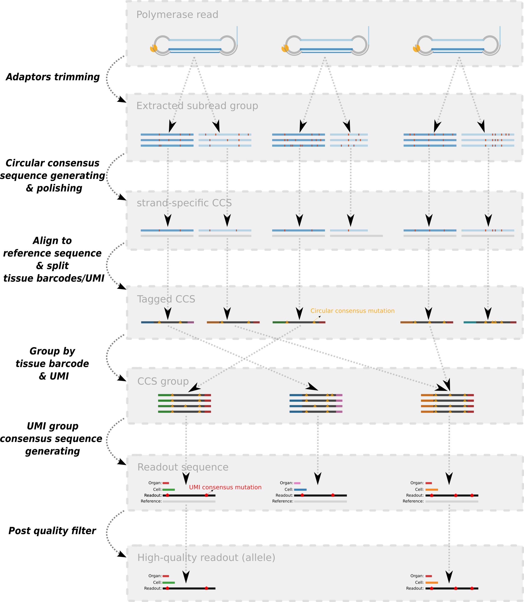
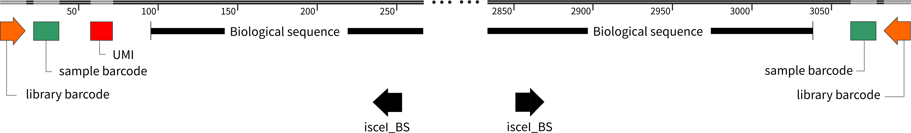

# **Single Molecule Sequecing Pipeline** (smrt)



## Adaptors Trimming

Polymerase reads of PacBio Sequel platform were trimmed by `bazbam` tool according to the adapter sequence.

- `baz2bam` version: `6.0`
- adapter sequence: `ATCTCTCTCAACAACAACAACGGAGGAGGAGGAAAAGAGAGAGAT`

## Circular Consensus Sequence Generation

CCS reads were generated by `ccs` tool in **stranded** mode:

```bash
ccs --min-passes=1 --min-length=1000 --max-length=10000 --by-strand --min-rq=0.66 -j=30 \
  --report-file=stranded_ccs.report stranded_ccs.bam
```

- `ccs` version: `4.0.0`
- outputfile: `stranded_ccs.bam`

## Align to Reference Sequence

Use `minimap2` tool to align CCS reads with reference sequence (3kb readout with barcode and UMI sequence).

- Prepare index file first

```bash
# generate index file
minimap2 -d ref.mmi ref.fa
```

- Convert bam format into fastq format, then run `minimap2` tool with optimized arguments,

```
minimap2 -O 2,12 -E 2,1 --score-N 0 --end-bonus 100 -a --MD -x map-pb ref.mmi output.bam
```

or take the [map_ccs_by_minimap2.sh](map_ccs_by_minimap2.sh) script in this repo.

## Annotate Sequence Features

After alignment, features of each CCS reads were extracted based on their relative locations.

As the diagram below, a fully aligned sequence contains

- a pairs of **libary barcodes** on both ends,
- a pairs **sample barcodes** on the inner side of the library barcode,
- an (Unique molecular indentifier) UMI on the 5' side,
- and a part biological sequence in the center of the read.

_biological sequence_ is opposite to _technical sequence_, which is introduced by PCR or ligation reaction.



And the relative position of each feature is shown in the table below.

| Feature        | Start | End  | Direction |
| -------------- | ----- | ---- | --------- |
| libary barcode | 1     | 16   | =>        |
| sample barcode | 22    | 38   | =>        |
| UMI            | 58    | 71   | =>        |
| BioSeq         | 96    | 3038 | =>        |
| sample barcode | 3063  | 3078 | =>        |
| libary barcode | 3084  | 3099 | <=        |

You can also take the [parse_feature.py](parse_feature.py) script in this repo to annotate sequence features.

## Link Sample Barcode Sequence

<details><summary>BARCODE TABLE (click to show more)</summary>
<p>

| Individual | Organ | Barcode_ID | Barcode_Sequence |
| ---------- | ----- | ---------- | ---------------- |
| Fly-1      | Ey    | BC02       | ACACACGCGAGACAGA |
| Fly-1      | Br    | BC03       | ACGCGCTATCTCAGAG |
| Fly-1      | Vc    | BC04       | CACACGCGCGCTATAT |
| Fly-1      | L1    | BC05       | ACACACTCTATCAGAT |
| Fly-1      | L2    | BC06       | CTATACATAGTGATGT |
| Fly-1      | L3    | BC07       | TATATATGTCTATAGA |
| Fly-1      | Wg    | BC08       | GAGACTAGAGATAGTG |
| Fly-1      | Hl    | BC09       | ATGTGTATATAGATAT |
| Fly-1      | Mg    | BC10       | GCGCGCGCACTCTCTG |
| Fly-1      | Hg    | BC11       | GTGTGTCTCGATGCGC |
| Fly-1      | Fb    | BC12       | TGTCATATGAGAGTGT |
| Fly-1      | Mp    | BC13       | TCTCGCGCGTGCACGC |
| Fly-1      | Gd    | BC14       | GATATATCGAGTATAT |
| Fly-1      | Ge    | BC15       | GTGTGCACTCACACTC |
| Fly-1      | Tr    | BC16       | CGTGTCTAGCGCGCGC |
| Fly-1      | Fg    | BC17       | GTGTGAGATATATATC |
| Fly-1      | Ck    | BC24       | GTGACACACAGAGCAC |
| Fly-2      | Sg    | BC01       | CACATATCAGAGTGCG |
| Fly-2      | Ey    | BC02       | ACACACGCGAGACAGA |
| Fly-2      | Br    | BC03       | ACGCGCTATCTCAGAG |
| Fly-2      | Vc    | BC04       | CACACGCGCGCTATAT |
| Fly-2      | L1    | BC05       | ACACACTCTATCAGAT |
| Fly-2      | L2    | BC06       | CTATACATAGTGATGT |
| Fly-2      | L3    | BC07       | TATATATGTCTATAGA |
| Fly-2      | Wg    | BC08       | GAGACTAGAGATAGTG |
| Fly-2      | Hl    | BC09       | ATGTGTATATAGATAT |
| Fly-2      | Mg    | BC10       | GCGCGCGCACTCTCTG |
| Fly-2      | Hg    | BC11       | GTGTGTCTCGATGCGC |
| Fly-2      | Fb    | BC12       | TGTCATATGAGAGTGT |
| Fly-2      | Mp    | BC13       | TCTCGCGCGTGCACGC |
| Fly-2      | Gd    | BC14       | GATATATCGAGTATAT |
| Fly-2      | Ge    | BC15       | GTGTGCACTCACACTC |
| Fly-2      | Tr    | BC16       | CGTGTCTAGCGCGCGC |
| Fly-2      | Fg    | BC17       | GTGTGAGATATATATC |
| Fly-2      | Mo    | BC18       | GCGCACGCACTACAGA |

</p>
</details>

For an annotated read, both **sample barcodes** (16 bp each) on 5' and 3' end were compared to the **input barcode sequence**.

- The most similar barcode link the read to a putative organ.
- Both **sample barcodes** should link to a identical organ.
- The maxium edit distance of the sample barcodes to the input barcode, should be less than 10%, which means no more than 1 mismatch on the sample barcode.

Refer [parse_feature.py](parse_feature.py) script for more details.

## Cluster Molecular Indentifier (UMI) Sequence

UMI sequences (14 bp) of each sample were clustered by `unsearch` tool, with a a variant of the UCLUST algorithm.
After a clustering, identical / similar UMI sequences can be linked to an unique ID.

Refer [cluster_umi.sh](cluster_umi.sh) script for more details.

## Split Data by Sample Barcode and Molecular Indentifier

Refer [run_annotate_umi.sh](run_annotate_umi.sh) script for more details.
